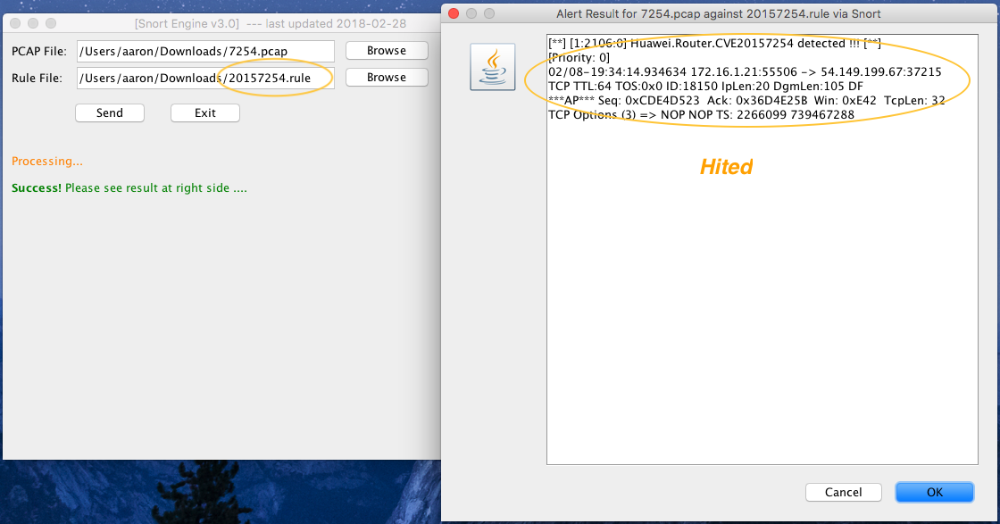
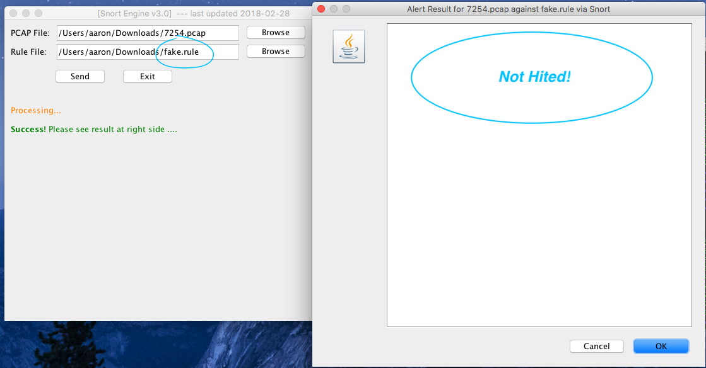
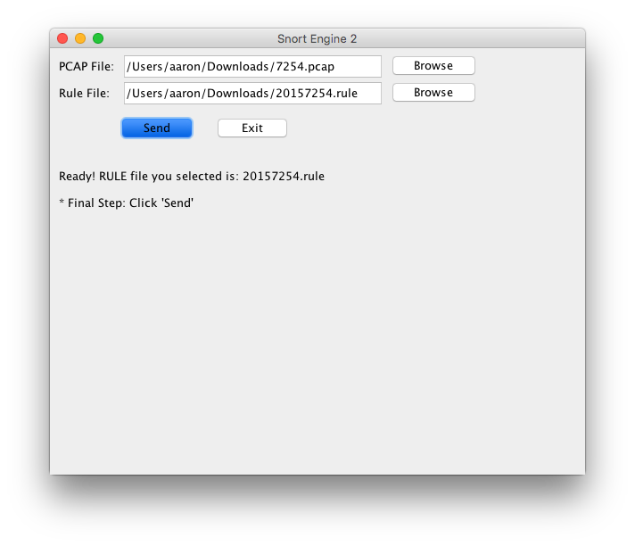
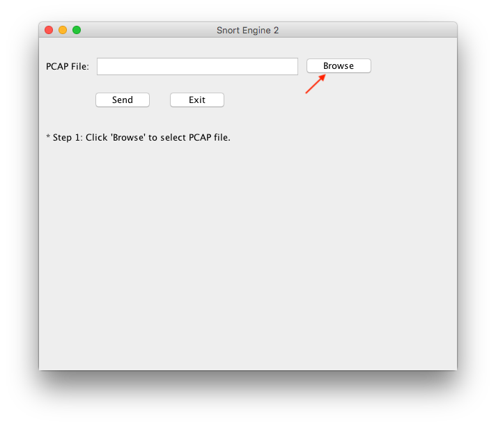
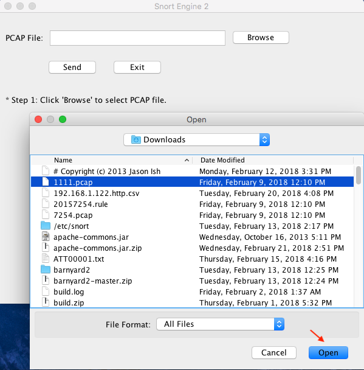
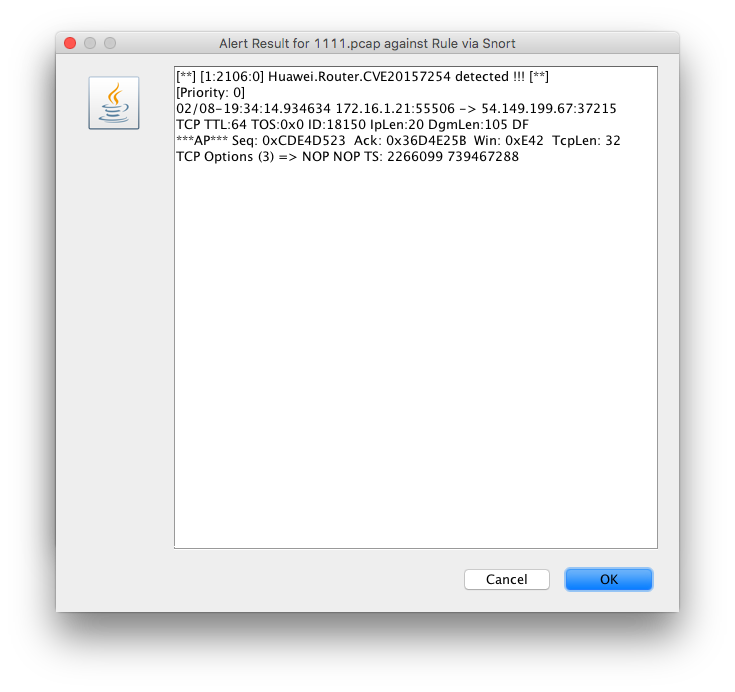
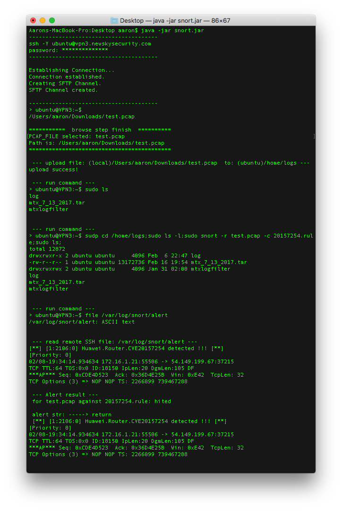

---
## Update 2/28/18  (v3.0)
- 1. fix cache remaining bug (previous result reserved)
- 2. better UI

-------------
### How to run:  
```js
java -jar snort_with_rule.jar
```
<a></a>  
<a></a>  


---
## Update 2/27/18  (v2.0)
- 1. added rule customized section
- 2. fix azure bug 
- 3. fix pcap/cap bug

-------------
### How to run:  
```js
java -jar snort_with_rule.jar
```
<a></a>  

  


---
# Tool  for  Snort (2/22/18) (v1.0)
-------------
A toolkit for quick analysis on certain PCAP file. Written in java.

### How to run:  
```js
java -jar snort.jar
```

### How to use:
1. <a></a>  

2. <a></a>  

3. <a></a>  

4. <a></a> 

### Test Sample:

<a></a>  
