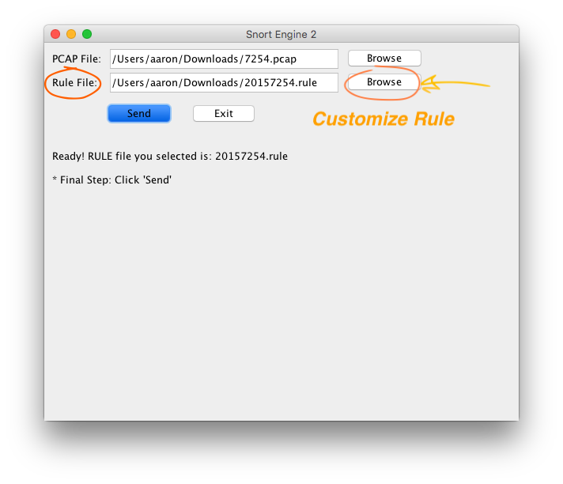
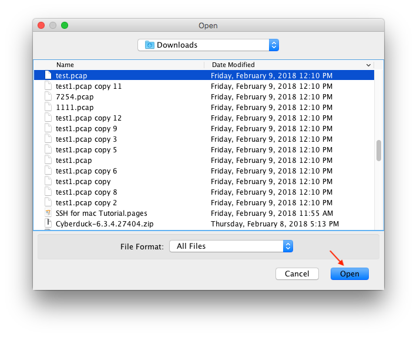
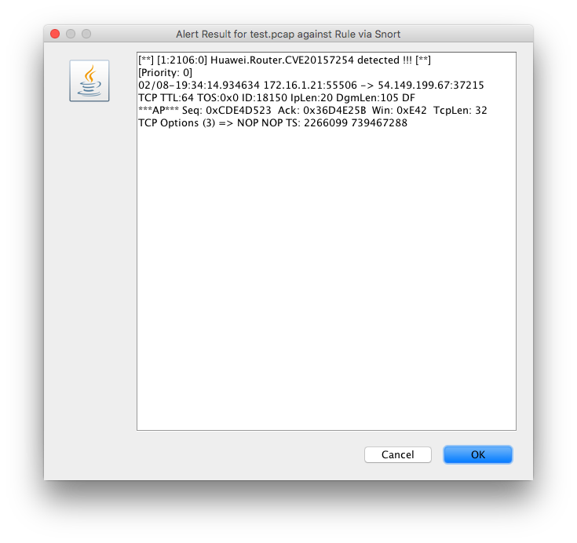

## Cloud Snort (v4.0) -- 4/6/2018

Download "snort_v4.jar" file.

### How to run:  
```js
java -jar snort_v4.jar


* Latest rule file can be directly put into a local folder without having to manually modify snort's code or jar file. 
(Info about where the folder is, will pop up when snort is started)

```

### How to test:  
```js
Download "7254.pcap" and "20157254.rule" for test.
```
<a></a>  


## [Previous Log] -- Ignore Below.

## Update 2/28/18  (v3.0)
- 1. fix cache remaining bug (previous result reserved)
- 2. better UI

<a></a>  
<a></a> 


-------------
### How to run:  
```js
java -jar snort_with_rule.jar
```


-------------
## Update 2/27/18  (v2.0)

- 1. added rule customized section
- 2. fix azure bug 
- 3. fix pcap/cap bug

<a></a>  

 


  


---
# Tool  for  Snort (2/22/18) (v1.0)
-------------
A toolkit for quick analysis on certain PCAP file. Written in java.

### How to run:  
```js
java -jar snort.jar
```

### How to use:
1. <a></a>  

2. <a></a>  

3. <a></a>  

4. <a></a> 

### Test Sample:

<a></a>  
