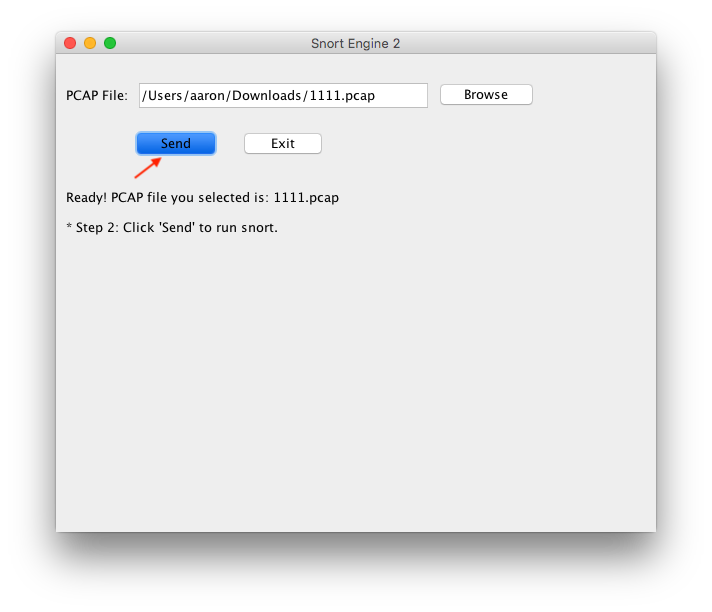

---
# Tool  for  Snort
-------------
A toolkit for quick analysis on certain PCAP file. Written in java.

  


### How to run:  
```js
java -jar snort.jar
```

### How to use:
1. <a></a>  

2. <a></a>  

3. <a></a>  

4. <a></a> 

### Test Sample:

<a></a>  
